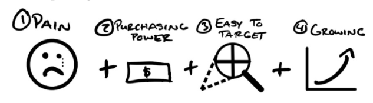

# Key concepts

## Value Equation

Value = ( Benefit * Percieved Likehood ) / ( Delay * Sacrifices )

## Market Searching

- Indentify the pain
- Make sure market has purchasing power
- Make sure it's easy to target
- Make sure it's growing

