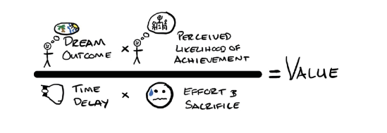
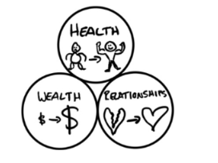
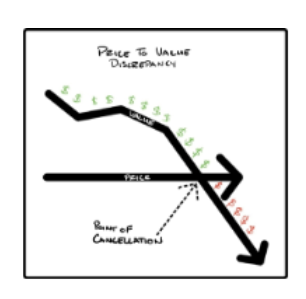
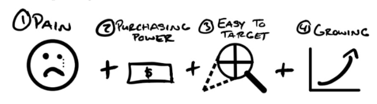
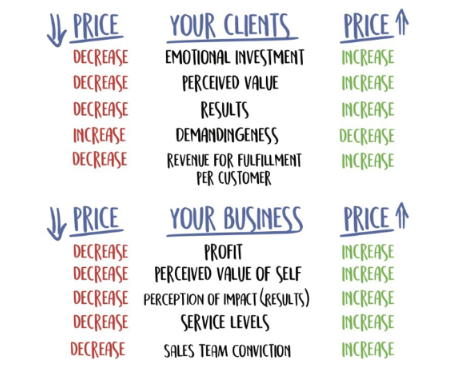
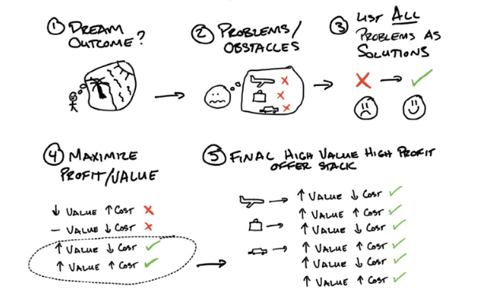

# Summary on Alex Hormozi Books

## Value Equation

Value = ( Benefit * Percieved Likehood ) / ( Delay * Sacrifices )

## Three Main Markets

- Health
- Wealth
- Relationships

## Price to Value Divergency

## Market Searching

- Indentify the pain
- Make sure market has purchasing power
- Make sure it's easy to target
- Make sure it's growing

## Perceived Price and Value

## Levers of Success

- Starving Crowd ( demand ) > Offer Strength > Persuation Skill

## Convergent Thinking vs Divergent Thinking

| **Aspect**          | **Convergent Thinking**                      | **Divergent Thinking**                       |
|---------------------|----------------------------------------------|----------------------------------------------|
| **Goal**            | Seeks a single, correct answer               | Explores multiple possible answers           |
| **Approach**        | Logical, analytical, and focused             | Creative, open-ended, and expansive          |
| **Space of Problem**| Narrows down options to find the best solution| Generates a variety of ideas and solutions |
| **Applications**    | Used in standardized tests, decision-making  | Used in brainstorming, creative tasks        |
| **Thinking Style**  | Structured and systematic                    | Unstructured and spontaneous                 |

## Creating Offer

## Advices

- Don't compete on price
- Price is what you pay. Value is what you get.
