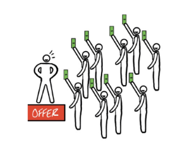

# Summary on Alex Hormozi Books

## Value Equation

Value = ( Benefit * Percieved Likehood ) / ( Delay * Sacrifices )

## Three Main Markets

- Health
- Wealth
- Relationships

## Price to Value Divergency

## Market Searching

- Indentify the pain
- Make sure market has purchasing power
- Make sure it's easy to target
- Make sure it's growing

## Perceived Price and Value

## Levers of Success

- Starving Crowd ( demand ) > Offer Strength > Persuation Skill

## Convergent Thinking vs Divergent Thinking

| **Aspect**          | **Convergent Thinking**                      | **Divergent Thinking**                       |
|  -  -  -  -  -  -  -  -  -  --|  -  -  -  -  -  -  -  -  -  -  -  -  -  -  -  -  -  -  -  -  -  -  -|  -  -  -  -  -  -  -  -  -  -  -  -  -  -  -  -  -  -  -  -  -  -  -|
| **Goal**            | Seeks a single, correct answer               | Explores multiple possible answers           |
| **Approach**        | Logical, analytical, and focused             | Creative, open-ended, and expansive          |
| **Space of Problem**| Narrows down options to find the best solution| Generates a variety of ideas and solutions |
| **Applications**    | Used in standardized tests, decision-making  | Used in brainstorming, creative tasks        |
| **Thinking Style**  | Structured and systematic                    | Unstructured and spontaneous                 |

## Creating Offer

1. Dream outcome
2. List all percieved problems
3. Turn all the problems into solutions, formulate as problems as questions
4. How: Deliver Vehicle
5. Trim Stack to High Value only. Evaluate each solution: cost for business, value for customer and trim to high value.

List all percieved problems in 4 categories:

- Not beneficial enough
- Too low likehood
- Too high delay
- Too large sacrifice

Turn all the problems into solutions:

- Every intricate step
- Everything that happens before and after achieving their goals
- What next problem will they face
- How can we make it worth it?
- How can we make it easier?
- How can we make it faster?
- How can we make it enjoyable, sustainable, and something they believe they can do?

How: Deliver Vehicle

- Group Ratio
  - 1-1
  - Small Group
  - One to Many
- Level of Effort On Their Part
  - Do It Yourself (DIY)
  - Done-With-You (DWY)
  - Done-For-You (DFY)
- Support Levels & Types
  - SMS
  - Chat
  - Email
  - Expert vs Normal
  - Phone
  - Zoom
- Consumption Types
  - Live/Virtual
  - Recorded
  - In Person
  - Written
  - Audio
  - Video
- Speed & Convenience
  - 24/7
  - 9-5 M-F
  - How fast will you reply to questions? Are there levels?
- 10x to 1/10th test
  - What would I deliver if my product cost 10x its current amount
  - What would I deliver if my product cost 1/10th its current cost and had to
provide more value than I currently am at my current price?

Formulas

- X specific outcome in Y time period without Z pain/fear.

## Advices

- Don't compete on price
- Price is what you pay. Value is what you get.
- Target 80% margin or more because margin is going only decrease with time.
- Create flow first then add friction.
-